# Database ERD

Generated from the local PostgreSQL `public` schema, verified against the running `linvnix-postgres` container on 2026-06-21.

Current application table count: **27**.

Notes:

- Every table inherits the base columns `id`, `created_at`, `updated_at`, and nullable soft-delete column `deleted_at`.
- `enum` means a PostgreSQL enum generated by TypeORM.
- Relation labels include the FK column and the database delete behavior.
- Role/permission tables were removed; authorization is now represented by `users.role`.
- Token storage is intentionally split by lifecycle: `auth_tokens` for short-lived verification/reset codes, `refresh_tokens` for login sessions.
- `bookmarks` is a polymorphic bookmark table: exactly one of `vocabulary_id` or `personal_vocabulary_id` should be set by application logic.
- `exercises` has a self-reference via `replaces_exercise_id` (a regenerated exercise points to the one it replaces; `SET NULL` on delete) and an `owner_user_id` (`CASCADE`) for custom exercises.
- `media_assets` stores uploaded media metadata; `uploaded_by` is a free-text varchar (not an FK), so it has no relation line in the diagram.

```mermaid
erDiagram
  users {
    uuid id PK
    timestamp created_at
    timestamp updated_at
    timestamp deleted_at
    varchar email
    varchar password
    varchar google_id
    varchar provider
    varchar full_name
    varchar native_language
    enum current_level
    varchar avatar_url
    enum preferred_dialect
    boolean email_verified
    timestamp email_verified_at
    boolean onboarding_completed
    enum role
    boolean notification_enabled
    varchar notification_time
  }

  auth_tokens {
    uuid id PK
    timestamp created_at
    timestamp updated_at
    timestamp deleted_at
    varchar token
    varchar code
    enum purpose
    uuid user_id FK
    timestamp expires_at
    timestamp used_at
  }

  refresh_tokens {
    uuid id PK
    timestamp created_at
    timestamp updated_at
    timestamp deleted_at
    varchar token
    uuid user_id FK
    timestamp expires_at
    timestamp revoked_at
    varchar user_agent
    varchar ip_address
  }

  courses {
    uuid id PK
    timestamp created_at
    timestamp updated_at
    timestamp deleted_at
    varchar title
    text description
    enum level
    int order_index
    boolean is_published
    varchar thumbnail_url
    int estimated_hours
  }

  modules {
    uuid id PK
    timestamp created_at
    timestamp updated_at
    timestamp deleted_at
    varchar title
    text description
    int order_index
    int estimated_hours
    uuid course_id FK
  }

  lessons {
    uuid id PK
    timestamp created_at
    timestamp updated_at
    timestamp deleted_at
    varchar title
    text description
    int order_index
    int estimated_duration
    uuid module_id FK
  }

  lesson_contents {
    uuid id PK
    timestamp created_at
    timestamp updated_at
    timestamp deleted_at
    text vietnamese_text
    text translation
    int order_index
    text notes
    uuid lesson_id FK
  }

  vocabularies {
    uuid id PK
    timestamp created_at
    timestamp updated_at
    timestamp deleted_at
    varchar word
    varchar translation
    enum part_of_speech
    text example_sentence
    text example_translation
    varchar audio_url
    varchar image_url
    varchar classifier
    jsonb dialect_variants
    jsonb audio_urls
    enum region
    uuid lesson_id FK
  }

  personal_vocabularies {
    uuid id PK
    timestamp created_at
    timestamp updated_at
    timestamp deleted_at
    varchar word
    varchar translation
    varchar part_of_speech
    text example_sentence
    text example_translation
    varchar classifier
    jsonb dialect_variants
    enum source
    uuid user_id FK
  }

  bookmarks {
    uuid id PK
    timestamp created_at
    timestamp updated_at
    timestamp deleted_at
    uuid user_id FK
    uuid vocabulary_id FK
    uuid personal_vocabulary_id FK
  }

  media_assets {
    uuid id PK
    timestamp created_at
    timestamp updated_at
    timestamp deleted_at
    enum kind
    varchar filename
    varchar original_name
    varchar url
    varchar mimetype
    bigint size
    varchar uploaded_by
  }

  grammar_rules {
    uuid id PK
    timestamp created_at
    timestamp updated_at
    timestamp deleted_at
    varchar title
    text explanation
    varchar structure
    jsonb examples
    text notes
    uuid lesson_id FK
  }

  exercises {
    uuid id PK
    timestamp created_at
    timestamp updated_at
    timestamp deleted_at
    uuid lesson_id FK
    uuid module_id FK
    uuid course_id FK
    text description
    varchar user_prompt
    boolean is_custom
    jsonb custom_config
    boolean is_ai_generated
    varchar title
    uuid owner_user_id FK
    text prompt_used
    int order_index
    varchar generation_status
    uuid replaces_exercise_id FK
  }

  questions {
    uuid id PK
    timestamp created_at
    timestamp updated_at
    timestamp deleted_at
    enum question_type
    text question
    varchar question_audio_url
    jsonb options
    jsonb correct_answer
    text explanation
    int order_index
    uuid exercise_id FK
  }

  question_attempts {
    uuid id PK
    timestamp created_at
    timestamp updated_at
    timestamp deleted_at
    jsonb user_answer
    boolean is_correct
    int score
    timestamp attempted_at
    int time_taken
    uuid user_id FK
    uuid question_id FK
  }

  user_question_results {
    uuid id PK
    timestamp created_at
    timestamp updated_at
    timestamp deleted_at
    jsonb user_answer
    boolean is_correct
    int score
    timestamp attempted_at
    int time_taken
    int attempt_count
    int best_score
    uuid last_attempt_id FK
    uuid user_id FK
    uuid question_id FK
  }

  learning_progress {
    uuid id PK
    timestamp created_at
    timestamp updated_at
    timestamp deleted_at
    enum unit_type
    enum status
    int score
    timestamp completed_at
    timestamp last_accessed_at
    int time_spent
    boolean content_viewed
    int completed_lessons_count
    int total_lessons_count
    int completed_modules_count
    int total_modules_count
    uuid user_id FK
    uuid lesson_id FK
    uuid module_id FK
    uuid course_id FK
  }

  daily_goals {
    uuid id PK
    timestamp created_at
    timestamp updated_at
    timestamp deleted_at
    uuid user_id FK
    enum goal_type
    int target_value
  }

  daily_goal_progress {
    uuid id PK
    timestamp created_at
    timestamp updated_at
    timestamp deleted_at
    uuid user_id FK
    date date
    int exercises_completed
    int lessons_completed
  }

  daily_streaks {
    uuid id PK
    timestamp created_at
    timestamp updated_at
    timestamp deleted_at
    uuid user_id FK
    int current_streak
    int longest_streak
    date last_goal_met_date
  }

  conversations {
    uuid id PK
    timestamp created_at
    timestamp updated_at
    timestamp deleted_at
    uuid user_id FK
    uuid course_id FK
    uuid lesson_id FK
    varchar model
    text system_instruction
    varchar title
    jsonb screen_context
    int total_tokens
    int total_prompt_tokens
    int total_completion_tokens
  }

  conversation_messages {
    uuid id PK
    timestamp created_at
    timestamp updated_at
    timestamp deleted_at
    uuid conversation_id FK
    enum role
    text content
    jsonb tool_calls
    jsonb tool_results
    int token_count
    boolean interrupted
  }

  scenario_categories {
    uuid id PK
    timestamp created_at
    timestamp updated_at
    timestamp deleted_at
    varchar name
    text description
    varchar icon
    varchar color
    int order_index
  }

  scenarios {
    uuid id PK
    timestamp created_at
    timestamp updated_at
    timestamp deleted_at
    uuid category_id FK
    varchar title
    text description
    text system_prompt
    text opening_message
    enum required_level
    enum difficulty
    jsonb scoring_criteria
    int max_turns
    int estimated_minutes
    boolean is_published
  }

  scenario_characters {
    uuid id PK
    timestamp created_at
    timestamp updated_at
    timestamp deleted_at
    uuid scenario_id FK
    varchar name
    varchar role
    text personality
    text speech_style
    varchar avatar_key
    boolean is_playable
    int order_index
  }

  simulation_sessions {
    uuid id PK
    timestamp created_at
    timestamp updated_at
    timestamp deleted_at
    uuid user_id FK
    uuid scenario_id FK
    uuid chosen_character_id FK
    enum status
    int total_tokens
    varchar next_turn_character_id
    int total_score
    jsonb criteria_scores
    enum end_reason
    text ai_summary
    int total_messages
    timestamp result_created_at
  }

  simulation_messages {
    uuid id PK
    timestamp created_at
    timestamp updated_at
    timestamp deleted_at
    uuid session_id FK
    uuid speaker_character_id FK
    boolean is_learner
    text content
    text translation
    jsonb feedback
    int order_index
  }

  users ||--o{ auth_tokens : "user_id CASCADE"
  users ||--o{ refresh_tokens : "user_id CASCADE"
  users ||--o{ bookmarks : "user_id CASCADE"
  users ||--o{ personal_vocabularies : "user_id CASCADE"
  users ||--o{ learning_progress : "user_id CASCADE"
  users ||--o{ daily_goals : "user_id CASCADE"
  users ||--o{ daily_goal_progress : "user_id CASCADE"
  users ||--o{ daily_streaks : "user_id CASCADE"
  users ||--o{ conversations : "user_id CASCADE"
  users ||--o{ question_attempts : "user_id CASCADE"
  users ||--o{ user_question_results : "user_id CASCADE"
  users ||--o{ simulation_sessions : "user_id CASCADE"

  courses ||--o{ modules : "course_id CASCADE"
  courses ||--o{ conversations : "course_id SET_NULL"
  courses ||--o{ exercises : "course_id CASCADE"
  courses ||--o{ learning_progress : "course_id CASCADE"

  modules ||--o{ lessons : "module_id CASCADE"
  modules ||--o{ exercises : "module_id CASCADE"
  modules ||--o{ learning_progress : "module_id CASCADE"

  lessons ||--o{ lesson_contents : "lesson_id CASCADE"
  lessons ||--o{ vocabularies : "lesson_id CASCADE"
  lessons ||--o{ grammar_rules : "lesson_id CASCADE"
  lessons ||--o{ exercises : "lesson_id CASCADE"
  lessons ||--o{ conversations : "lesson_id SET_NULL"
  lessons ||--o{ learning_progress : "lesson_id CASCADE"

  vocabularies ||--o{ bookmarks : "vocabulary_id CASCADE"
  personal_vocabularies ||--o{ bookmarks : "personal_vocabulary_id CASCADE"

  users ||--o{ exercises : "owner_user_id CASCADE"
  exercises ||--o{ exercises : "replaces_exercise_id SET_NULL"
  exercises ||--o{ questions : "exercise_id CASCADE"
  questions ||--o{ question_attempts : "question_id CASCADE"
  questions ||--o{ user_question_results : "question_id CASCADE"
  question_attempts ||--o{ user_question_results : "last_attempt_id SET_NULL"

  conversations ||--o{ conversation_messages : "conversation_id CASCADE"

  scenario_categories ||--o{ scenarios : "category_id CASCADE"
  scenarios ||--o{ scenario_characters : "scenario_id CASCADE"
  scenarios ||--o{ simulation_sessions : "scenario_id CASCADE"
  scenario_characters ||--o{ simulation_sessions : "chosen_character_id RESTRICT"
  scenario_characters ||--o{ simulation_sessions : "next_turn_character_id RESTRICT"
  scenario_characters ||--o{ simulation_messages : "speaker_character_id SET_NULL"
  simulation_sessions ||--o{ simulation_messages : "session_id CASCADE"
```

## Current Tables

1. `auth_tokens`
2. `bookmarks`
3. `conversation_messages`
4. `conversations`
5. `courses`
6. `daily_goal_progress`
7. `daily_goals`
8. `daily_streaks`
9. `exercises`
10. `grammar_rules`
11. `learning_progress`
12. `lesson_contents`
13. `lessons`
14. `media_assets`
15. `modules`
16. `personal_vocabularies`
17. `question_attempts`
18. `questions`
19. `refresh_tokens`
20. `scenario_categories`
21. `scenario_characters`
22. `scenarios`
23. `simulation_messages`
24. `simulation_sessions`
25. `user_question_results`
26. `users`
27. `vocabularies`
